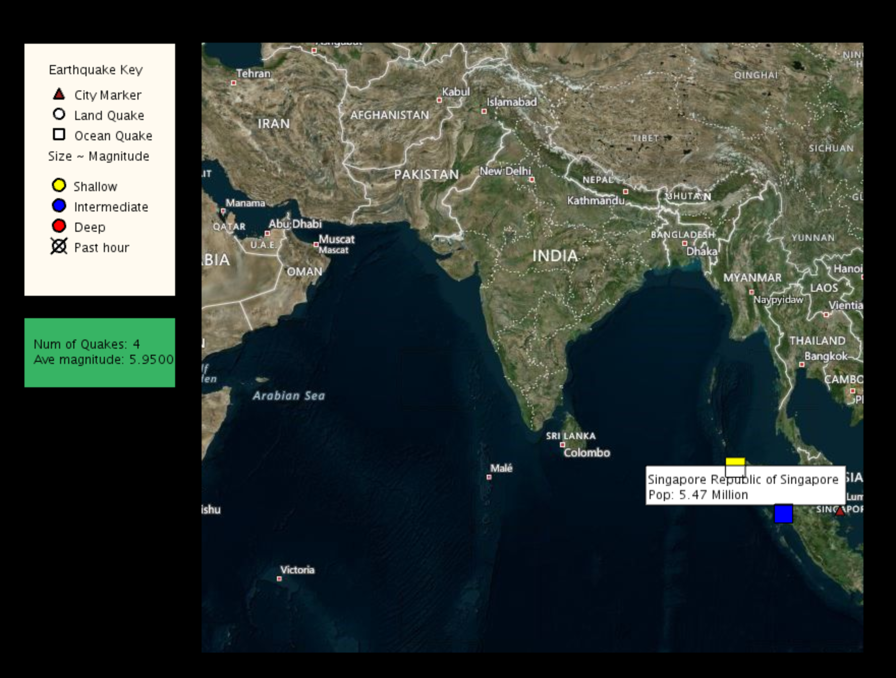

# CoolMaps

CoolMaps is a Java project designed to create a map visualization map of the earthquakes and airports within the world. It shows a variety of information with our Live Earthquake Map. You can view the magnitude, location and affected surrounding areas.

The API will enable you to (1) create a map and customize its appearance; (2) create overlays showing your location (or any point on earth), earthquakes, or airports. One can zoom into areas of interest so that one can see exactly where and when these events occurred.

The project is unique because its algorithms make all paths visible at once by unfolding the map into a single surface, making it easy to see all possible routes at once. The result of this visualization allows users to explore patterns in human migration and flight paths.